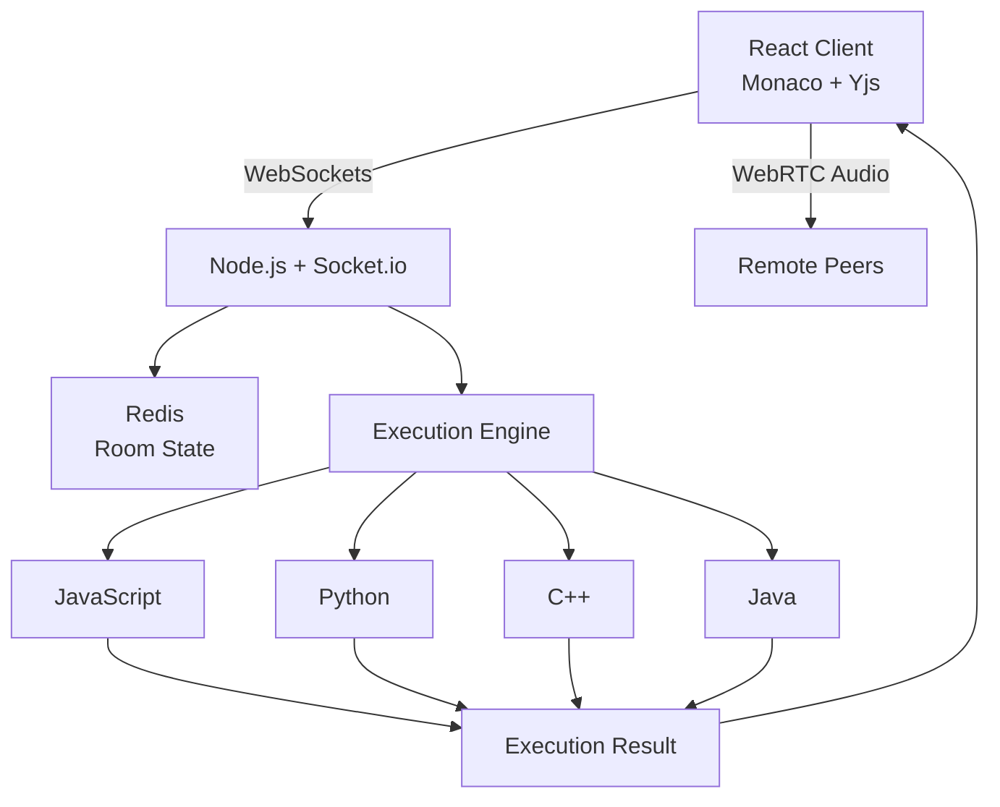

# CodeSync 🚀
> A high-performance, real-time collaborative IDE featuring conflict-free document editing, peer-to-peer mesh voice chat, and isolated execution sandboxes.

---

## 🌟 Overview

**CodeSync** is a modern full-stack web application that allows developers to collaborate in real time within shared workspaces. Built to eliminate synchronization friction during pair programming and technical interviews, CodeSync features live cursor tracking, conflict-free document CRDTs, peer-to-peer voice channels, and multi-language execution.

---

## ✨ Key Features

- **⚡ Real-Time Collaborative Editing:** Powered by **Yjs (CRDTs)** and WebSockets for low-latency, conflict-free text synchronization and live remote cursor tracking.
- **🎙️ Peer-to-Peer Mesh Voice Chat:** Integrated full-mesh **WebRTC** audio streaming with dynamic active-speaker detection indicators and mute controls.
- **🛡️ Access Control & Room Limits:** Secure workspace access with custom passcodes, capacity enforcement, and persistent Redis-backed room state.
- **💻 Interactive Code Execution Engine:** Compile and execute code locally across multiple programming languages (JavaScript, Python, C++, Java) with detailed console outputs and runtimes.
- **🎨 Modern Responsive UI:** Powered by **Monaco Editor** with custom active line markers, remote user decorations, collapsible sidebars, and mobile-friendly viewports.

---

## 🛠️ Tech Stack

### **Frontend**
- **Framework:** React.js (Vite)
- **Styling:** Tailwind CSS / Custom CSS
- **Code Editor:** Monaco Editor (`@monaco-editor/react`)
- **Real-Time Data Sync:** Yjs (Conflict-Free Replicated Data Types)
- **Networking:** Socket.io-client, WebRTC (Native Media APIs)

### **Backend**
- **Runtime:** Node.js, Express.js
- **State & In-Memory Store:** Redis
- **Real-Time Server:** Socket.io / WebSockets (`y-websocket`)
- **Code Execution:** Isolated local engine with process runner

---

## 🏗️ Architecture

## 🚀 Getting Started Locally

### Prerequisites
- **Node.js** (v18+ recommended)
- **Redis Server** (Running locally or via cloud instance)

### Installation

1. **Clone the repository:**
   git clone https://github.com/Ghoul-07/Code-sync.git
   cd Code-sync

2. **Setup Server:**
   cd server
   npm install

3. **Setup Client:**
   cd ../client
   npm install

### Running the Application

1. **Start Backend Server:**
   cd server
   npm run dev

2. **Start Frontend Development Client:**
   cd client
   npm run dev

---

## 📝 License

Distributed under the MIT License. See `LICENSE` for more information.

---

Crafted with ❤️ by Vedant Chaturvedi (https://github.com/Ghoul-07)
